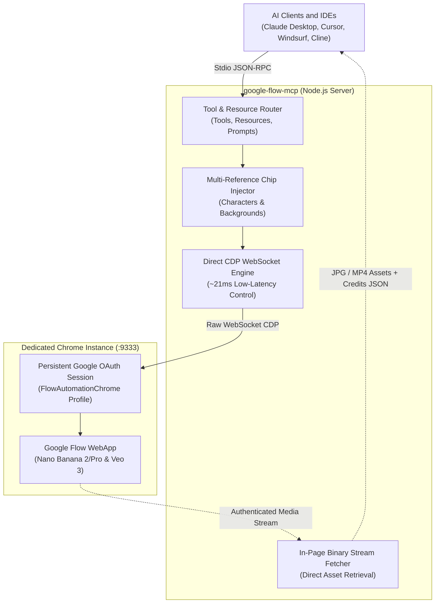

# Google Flow MCP Server

A session-backed, direct-CDP UI-to-MCP wrapper for Google Flow (`labs.google/fx/tools/flow`), implementing the Browser as an API paradigm to provide programmatic access to Nano Banana 2/Pro image generation and Veo 3 video generation models.

## Overview

This server acts as a UI-to-API bridge, enabling AI agents (Claude Desktop, Cursor, Windsurf, Cline, Antigravity, etc.) to control Google Flow using structured JSON-RPC over standard I/O. By attaching directly to an existing Chrome debugging session over WebSocket, it bypasses the need for official API keys, handles bot detection transparently via real user session context, and achieves sub-25ms execution latency with in-page binary streaming and live credit telemetry.

## Features

- Browser as an API: Treats the authenticated Google Flow web interface as a programmable, queryable tool for AI agents.
- Session-Backed CDP Engine: Connects directly over raw WebSocket to a persistent Chrome debugging profile, preserving Google OAuth session state and avoiding bot-detection challenges.
- Multi-Reference Injection: Attaches canonical character and background reference images directly into the prompt bar as input chips.
- In-Page Binary Streaming: Retrieves generated high-resolution assets via authenticated in-page `fetch()` without page reloads.
- Standardized MCP Interface: Exposes Tools, Resources (`flow://credits`, `flow://session`, `flow://projects`), and Prompt Templates.
- Cross-Platform Binary Discovery: Automatically locates Chrome, Brave, Chromium, or Edge installations across macOS, Windows, and Linux.
- Multi-Language UI Support: Employs semantic SVG icon matching and multilingual fallback dictionaries (KO, EN, JA, FR, ES).

## Prerequisites

- Node.js >= 18.0.0
- Google Chrome, Brave, Chromium, or Microsoft Edge
- An active Google account with access to Google Flow (`https://labs.google/fx/tools/flow`)

## Quick Start (3 Steps)

### 1. Clone and Install Dependencies

```bash
git clone https://github.com/vynnlee/google-flow-mcp.git
cd google-flow-mcp
npm install
```

### 2. Launch Dedicated Browser Profile

Run the cross-platform launcher to start your persistent automation browser:

```bash
npm run launch
```

Log in to your Google account once in the opened window. Your authentication is preserved across restarts in a dedicated user data directory.

*(Manual alternative: launch Chrome with `--remote-debugging-port=9333` and `--user-data-dir="<path>"`)*

### 3. Add to Your AI Client

Add the following standard MCP configuration to your AI client's settings:

```json
{
  "mcpServers": {
    "google-flow": {
      "command": "node",
      "args": [
        "/absolute/path/to/google-flow-mcp/src/index.js"
      ]
    }
  }
}
```

#### Settings File Locations

| Client | Configuration File Path |
| :--- | :--- |
| **Claude Desktop** | `~/Library/Application Support/Claude/claude_desktop_config.json` (macOS)<br>`%APPDATA%\Claude\claude_desktop_config.json` (Windows) |
| **Cursor** | `.cursor/mcp.json` or Settings > Features > MCP |
| **Windsurf** | `~/.codeium/windsurf/mcp_config.json` |
| **Cline / Roo Code** | `cline_mcp_settings.json` |
| **Zed** | `~/.config/zed/settings.json` (under `context_servers`) |

## Optional Configuration

Create `config/flow.config.json` to override default parameters:

```json
{
  "cdpPort": 9333,
  "expectedAccount": "your-email@gmail.com",
  "defaultImageModel": "Nano Banana 2",
  "defaultRatio": "16:9",
  "autoConfirm": false
}
```

## Components

### Tools

#### `flow_generate_image`
Generates images using Nano Banana 2, Nano Banana Pro, or Imagen 4 with optional reference image attachment.

Parameters:
- `prompt` (string, required): Detailed prompt describing the scene, subject, camera angle, and style.
- `reference_images` (string[], optional): Absolute file paths to reference images to inject as prompt chips.
- `model` (string, optional): `"Nano Banana 2"` (default), `"Nano Banana Pro"`, or `"Imagen 4"`.
- `ratio` (string, optional): `"16:9"` (default), `"9:16"`, `"1:1"`, `"4:3"`, or `"3:4"`.
- `auto_confirm` (boolean, optional): Set to `true` to execute generation and consume credits. If `false`, prepares the prompt in the UI without generating. Default: `false`.
- `output_folder` (string, optional): Directory path where downloaded files are saved.
- `response_format` (string, optional): `"detailed"` (default) or `"concise"`.

#### `flow_generate_video`
Generates video clips using Veo 3.1 or Omni Flash.

Parameters:
- `prompt` (string, required): Prompt describing camera movement and motion.
- `model` (string, optional): `"Veo 3.1 Lite"` (default), `"Veo 3.1 Quality"`, or `"Omni Flash"`.
- `duration` (string, optional): `"4s"`, `"6s"` (default), or `"8s"`.
- `ratio` (string, optional): `"16:9"` (default), `"9:16"`, or `"1:1"`.
- `auto_confirm` (boolean, optional): Default: `false`.
- `output_folder` (string, optional): Destination directory path.
- `response_format` (string, optional): `"detailed"` (default) or `"concise"`.

#### `flow_status`
Returns browser connection health, current account state, session validity, and real-time credit balance.

Parameters:
- `full` (boolean, optional): Include complete telemetry payload. Default: `true`.

#### `flow_manage_project`
Lists or creates projects on the Flow canvas.

Parameters:
- `action` (string, required): `"list"` or `"create"`.
- `name` (string, optional): Required when action is `"create"`.

#### `flow_download_latest`
Downloads the most recently rendered asset without triggering new generation.

Parameters:
- `output_folder` (string, optional): Destination directory.

#### `flow_connect` / `flow_disconnect`
Manages the connection state to the dedicated Chrome browser instance.

### Resources

- `flow://credits`: Returns real-time JSON payload containing remaining credit balance, subscription tier, and SKU.
- `flow://session`: Returns authenticated user profile, email address, and OAuth expiration timestamp.
- `flow://projects`: Returns array of active projects on the user's canvas.

### Prompts

- `consistent-storyboard-cut`: Parameterized template for generating camera-consistent scene cuts with character and environment references.

## Architecture



## Performance Benchmark

Measured on macOS against Google Chrome remote debugging port 9333 (5-run mean):

| Metric | Standard Automation (Playwright CDP) | Direct CDP WebSocket Engine | Delta |
| :--- | :---: | :---: | :---: |
| Initial Handshake | 354.25 ms | 21.80 ms | 16.2x faster |
| DOM Traversal / Query | 21.29 ms | 1.65 ms | 12.9x faster |
| Screenshot Capture | 383.92 ms | 359.95 ms | 6.2% faster |
| Single Transaction Runtime | 761.31 ms | 384.17 ms | 1.98x faster |
| Process Memory (RSS) | 166.81 MB | 52.31 MB | 68.6% reduction |

## Troubleshooting & FAQ

### Browser Connection Failed
- Ensure the browser is running with `--remote-debugging-port=9333`. You can verify by opening `http://localhost:9333/json` in your browser.
- If port 9333 is occupied by another process, change `cdpPort` in `config/flow.config.json`.

### Re-Authentication Required
- If Google Flow displays a login prompt, open the dedicated Chrome window, log in with your Google account, and refresh the page. The session will remain active.

### Using Custom Browser Paths
- Set the `CHROME_PATH` environment variable to point to your specific browser binary (e.g., Brave or Edge):
  ```bash
  export CHROME_PATH="/Applications/Brave Browser.app/Contents/MacOS/Brave Browser"
  ```

## Development & Testing

Run unit and connection tests:
```bash
npm test
```

Run full MCP specification compliance audit:
```bash
npm run test:e2e
```

Debug using MCP Inspector:
```bash
npx @modelcontextprotocol/inspector node src/index.js
```

## License

MIT License. Copyright (c) 2026 Vynn Lee.
